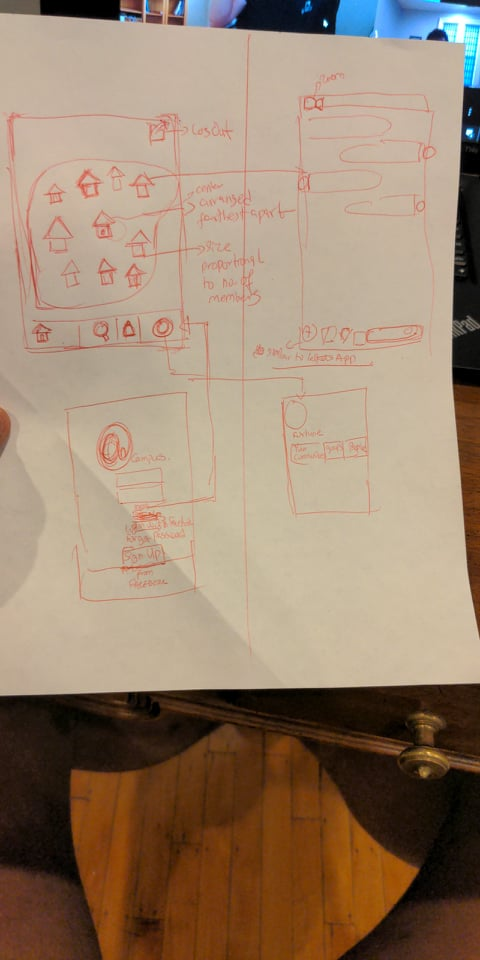

@Campus - README Template
===

# @Campus

## Table of Contents
1. [Overview](#Overview)
1. [Product Spec](#Product-Spec)
1. [Wireframes](#Wireframes)
2. [Schema](#Schema)

## Overview
### Description
OnCampus is an interface based social media app for school campuses that aims to build school spirit and a sense of community while fostering interaction among students. OnCampus is a map of student groups. Each certified student group can create their building anywhere on the map and customize it to their taste. Each building is a button to a chat for that student group. Each new building can be located in a random area of the map such that the buildings are furthest apart(this would likely require some algorithm), this can be initiated by the school app admin.

### App Evaluation
- **Category:** Social Media
- **Mobile:** The app needs to be on mobile since it is meant to an everyday app for groups to connect and feel like they are somewhat in the same room
- **Story:** Allows users to get involved in the groups on their campus and have a sense of belonging to the social ecosystem of their campus by providing interfacing that makes for the ease of advertisement of campus groups and interaction with such.
- **Market:** Students at campuses with a lot of clubs and student groups
- **Habit:** Users can log in and see a view of campus and can in later models access stories associated with group buildings. Public groups or private groups that students are a part of would be available to them OnClick and they are led to a group messaging view.
- **Scope:** Later inprovements of the app would provide weekly story reels from all the groups(most viewed stories compiled) and would alert members of a group or people associated with the group when there is a lot of activity in the group. 

## Product Spec

### 1. User Stories (Required and Optional)

**Required Must-have Stories**

* Multiple Views
   * Home page view showing all the clubs within the current users community
   * A profile page to see and edit the Users information, groups they are a part of, people they share interests with and communities they are a part of, as well as take a new profile picture.
   * A chat for each group
   * A sign up and a Log in view 
   * Search view to search for new groups
   * A Notifications Menu 
* ...

**Optional Nice-to-have Stories**

* [fill in your required user stories here]
* ...

### 2. Screen Archetypes

* [list first screen here]
   * [list associated required story here]
   * ...
* [list second screen here]
   * [list associated required story here]
   * ...

### 3. Navigation

**Tab Navigation** (Tab to Screen)

* [fill out your first tab]
* [fill out your second tab]
* [fill out your third tab]

**Flow Navigation** (Screen to Screen)

* [list first screen here]
   * [list screen navigation here]
   * ...
* [list second screen here]
   * [list screen navigation here]
   * ...

## Wireframes
[Add picture of your hand sketched wireframes in this section]
 

### [BONUS] Digital Wireframes & Mockups

### [BONUS] Interactive Prototype

## Schema 
[This section will be completed in Unit 9]
### Models
[Add table of models]
### Networking
- [Add list of network requests by screen ]
- [Create basic snippets for each Parse network request]
- [OPTIONAL: List endpoints if using existing API such as Yelp]
